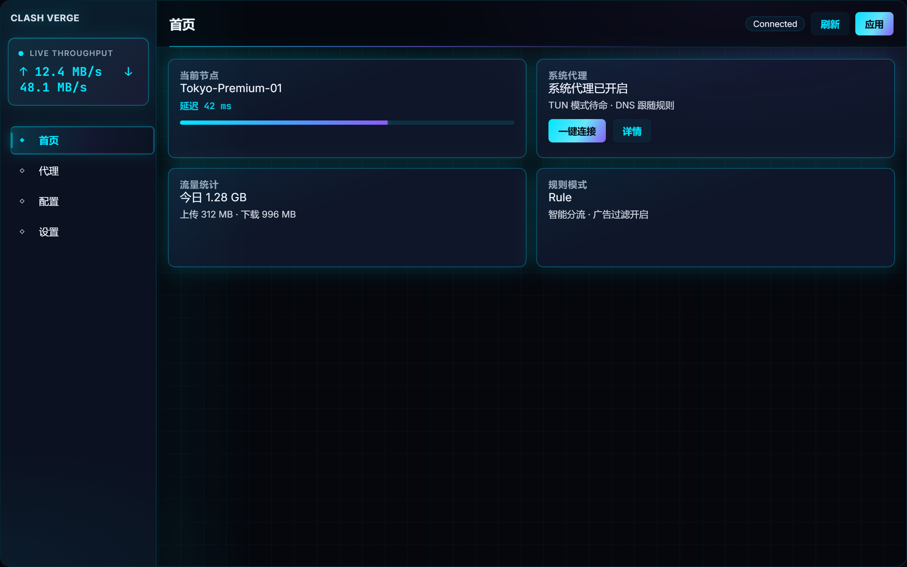
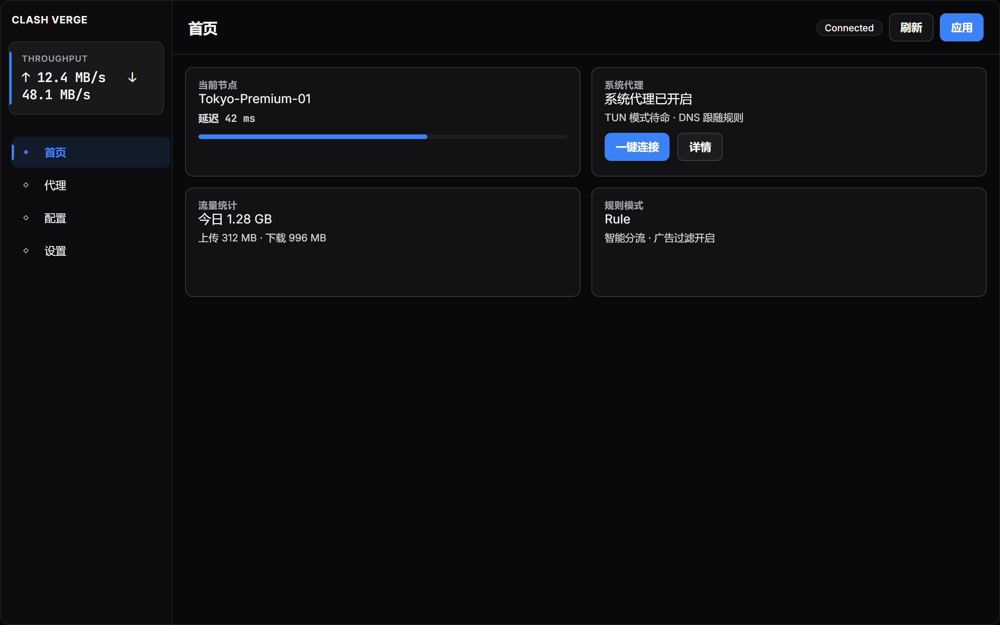
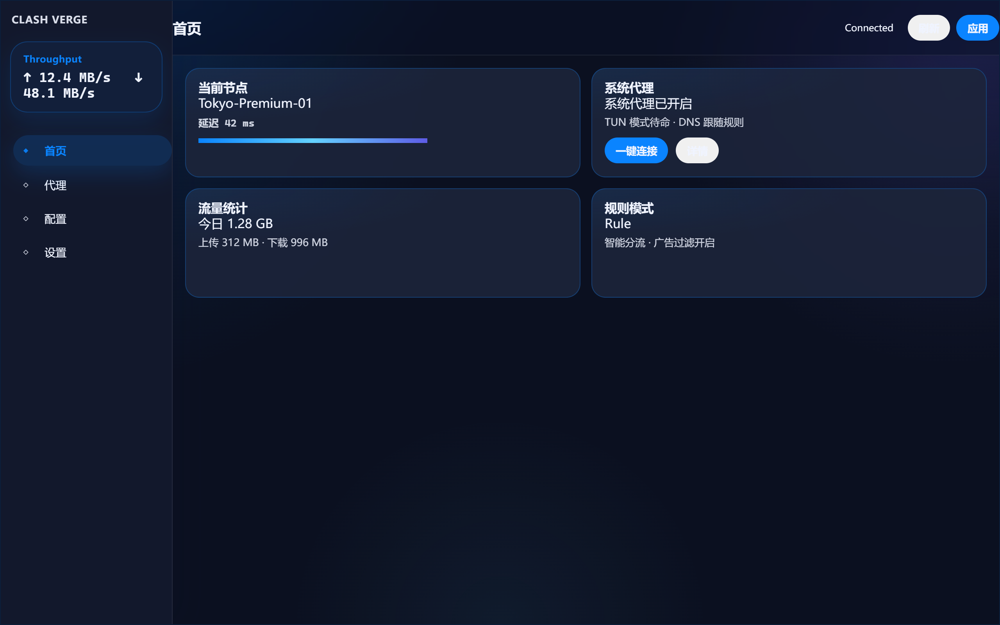
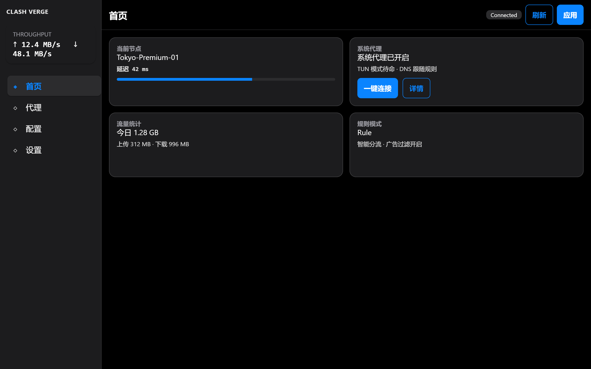
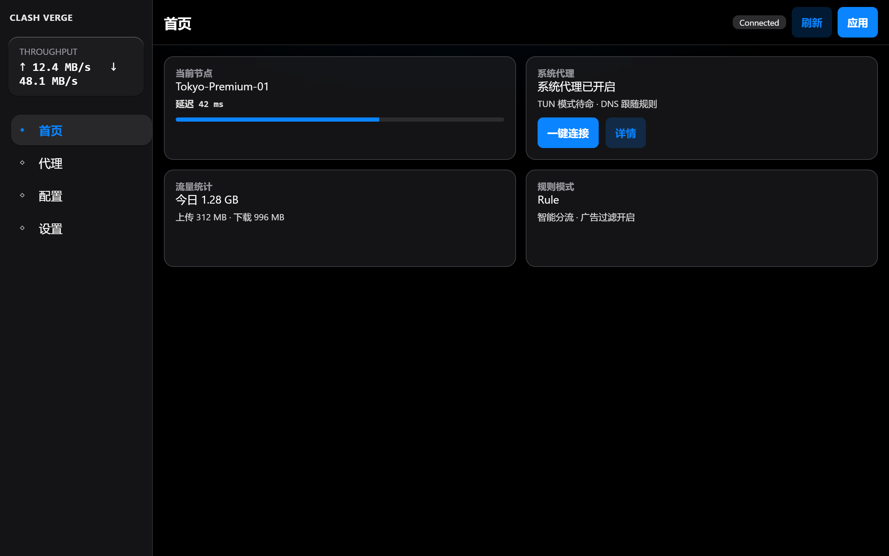

# Clash Verge 主题 / Clash Verge Themes

免费开源的 **Clash Verge Rev CSS 主题包**：一键美化侧栏、卡片、流量统计与设置页。支持赛博风、苹果风、毛玻璃等多种风格，通过官方 **CSS Injection（编辑 CSS）** 即可使用，无需改源码、无需 fork。

[](https://github.com/endlessYoung/clash-verge-themes/releases/tag/v1.0.1)
[](./LICENSE)
[](https://github.com/clash-verge-rev/clash-verge-rev)

**关键词：** Clash Verge 主题 · Clash Verge Rev 美化 · CSS Injection · 赛博主题 · 苹果风格主题 · 毛玻璃 UI · 深色模式主题

---

## 为什么用这个仓库？

- **官方能力即可用**：粘贴一行 `@import`，Clash Verge 立刻换肤  
- **五套成品主题**：赛博 / 专业蓝灰 / 极光玻璃 / Apple 设置风 / 液态玻璃  
- **浅色 + 深色**：跟随系统主题自动切换  
- **CDN 直链**：jsDelivr 全球加速，钉版本号更稳定  
- **开源 MIT**：可学习、可二次分发

完整步骤见 [使用说明 docs/USAGE.md](docs/USAGE.md)。

---

## 主题预览

| Cyber Nexus（赛博青紫） | AI Operator（专业蓝） |
|-------------------------|------------------------|
|  |  |

| Aurora Glass（极光玻璃） | Apple Classic（苹果设置风） |
|--------------------------|-----------------------------|
|  |  |

| Apple Liquid Glass（液态毛玻璃） |
|----------------------------------|
|  |

---

## 快速开始（30 秒）

1. 打开 **Clash Verge** → **设置** → **外观设置 / Theme Setting** → **编辑 CSS**  
2. 粘贴下面任意主题的 **一行** 代码  
3. 主题模式建议选 **系统**  
4. 保存

> 请使用版本标签 `@v1.0.1`（或具体 commit）。不要用 `@main` / `@develop` 分支名，避免 CDN 缓存到旧文件。

### Cyber Nexus — 赛博青紫玻璃

适合喜欢科技感、深色仪表盘氛围的用户。

```css
@import url("https://cdn.jsdelivr.net/gh/endlessYoung/clash-verge-themes@v1.0.1/dist/cyber-nexus.css");
```

### AI Operator — 简洁专业蓝

干净的产品级界面，蓝强调色，适合日常办公观感。

```css
@import url("https://cdn.jsdelivr.net/gh/endlessYoung/clash-verge-themes@v1.0.1/dist/ai-operator.css");
```

### Aurora Glass — 极光毛玻璃

柔和渐变与玻璃质感，侧栏与卡片更有空间层次。

```css
@import url("https://cdn.jsdelivr.net/gh/endlessYoung/clash-verge-themes@v1.0.1/dist/aurora-glass.css");
```

### Apple Classic — 苹果设置风格

接近 iOS / macOS「设置」列表气质：系统灰、系统蓝、清晰分组。

```css
@import url("https://cdn.jsdelivr.net/gh/endlessYoung/clash-verge-themes@v1.0.1/dist/apple-classic.css");
```

### Apple Liquid Glass — 液态玻璃

半透明毛玻璃材质，浮起与柔和高光，现代 Apple 风界面。

```css
@import url("https://cdn.jsdelivr.net/gh/endlessYoung/clash-verge-themes@v1.0.1/dist/apple-liquid.css");
```

---

## 主题对照表

| 主题名称 | 文件 | 风格一句话 |
|----------|------|------------|
| Cyber Nexus | `dist/cyber-nexus.css` | 赛博青紫 · 玻璃面板 |
| AI Operator | `dist/ai-operator.css` | 专业蓝 · 简洁高效 |
| Aurora Glass | `dist/aurora-glass.css` | 极光 · 空间玻璃 |
| Apple Classic | `dist/apple-classic.css` | 苹果设置 · 系统灰蓝 |
| Apple Liquid Glass | `dist/apple-liquid.css` | 液态毛玻璃 |

---

## 常见问题 FAQ

**Q: 粘贴后没有变化？**  
A: 确认用的是 `dist/*.css` 单文件地址；保存后重启 Clash Verge；检查是否只保留一条 `@import`。

**Q: 为什么不要用 raw.githubusercontent.com？**  
A: GitHub raw 常以 `text/plain` 返回，浏览器可能直接忽略样式。请用 jsDelivr。

**Q: 如何换主题？**  
A: 改 `@import` 里的文件名即可，每次只保留一行。

**Q: 支持浅色模式吗？**  
A: 支持。主题模式选「系统」，会跟随 Windows / macOS 浅色或深色。

**Q: 可以商用或二次分发吗？**  
A: 可以，遵循 [MIT License](./LICENSE)。

---

## 版本与下载

| 项目 | 说明 |
|------|------|
| 当前版本 | **v1.0.1** |
| 稳定分支 | `main` |
| 开发分支 | `develop` |
| 更新日志 | [CHANGELOG.md](./CHANGELOG.md) |
| 详细教程 | [docs/USAGE.md](docs/USAGE.md) |

仓库地址：<https://github.com/endlessYoung/clash-verge-themes>

---

## 本地预览（可选）

```bash
npx serve . -p 4173
```

浏览器打开：

- http://localhost:4173/docs/previews/cyber-nexus.html  
- http://localhost:4173/docs/previews/ai-operator.html  
- http://localhost:4173/docs/previews/aurora-glass.html  
- http://localhost:4173/docs/previews/apple-classic.html  
- http://localhost:4173/docs/previews/apple-liquid.html  

---

## License

MIT © contributors
